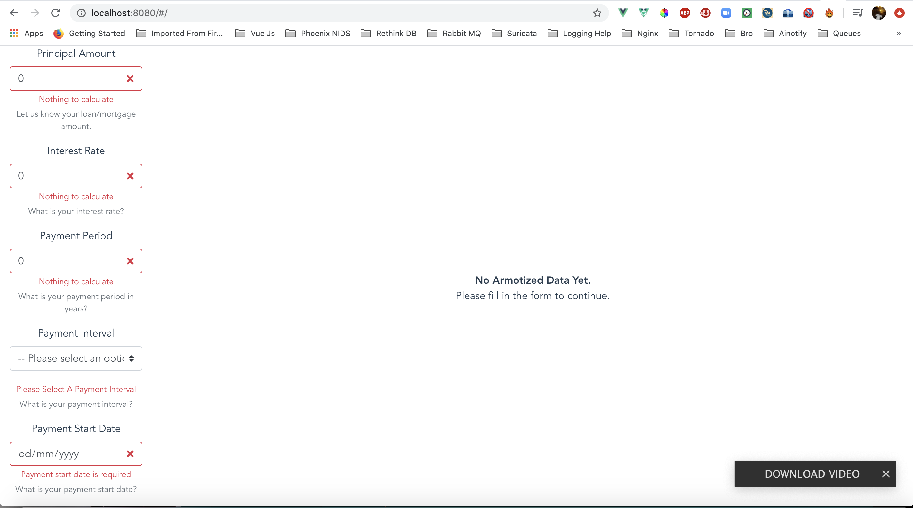
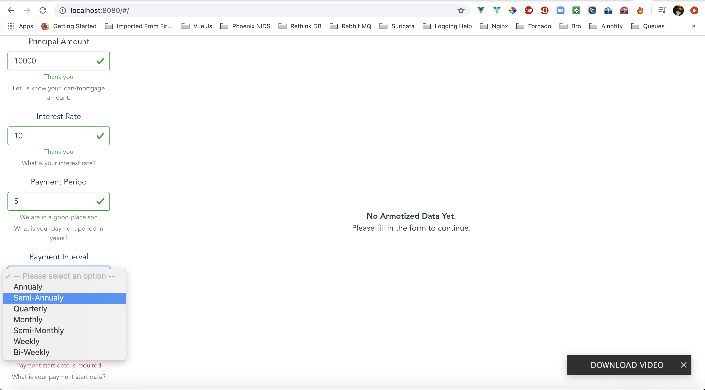
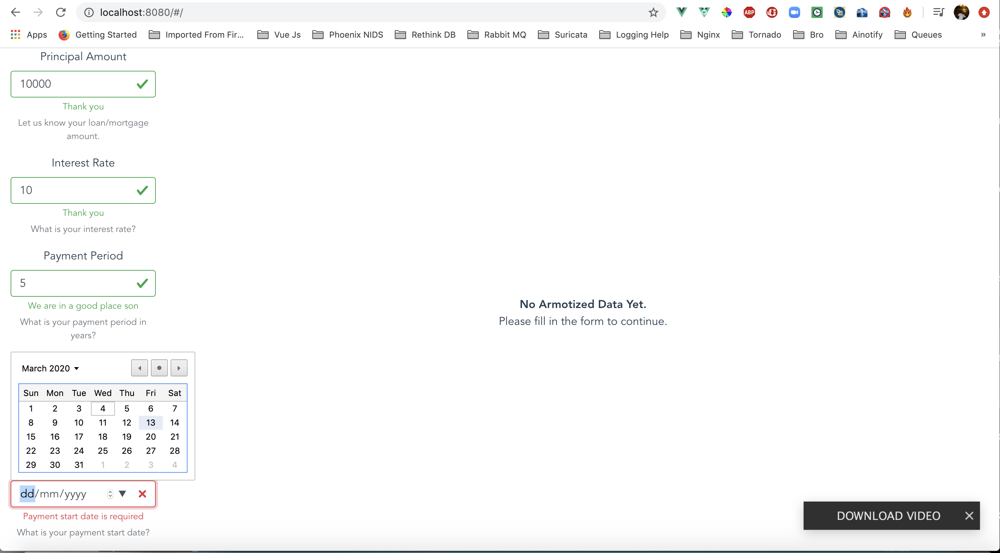
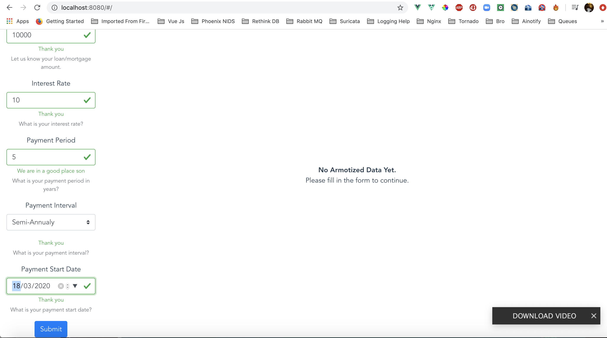
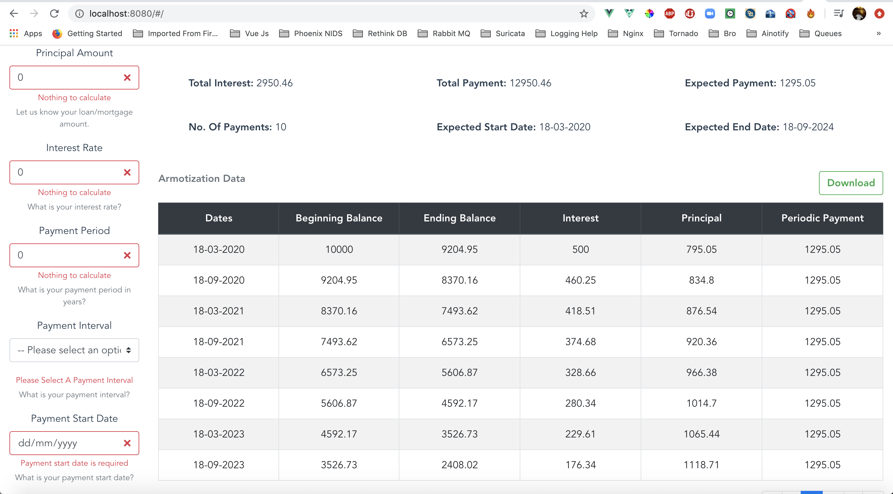
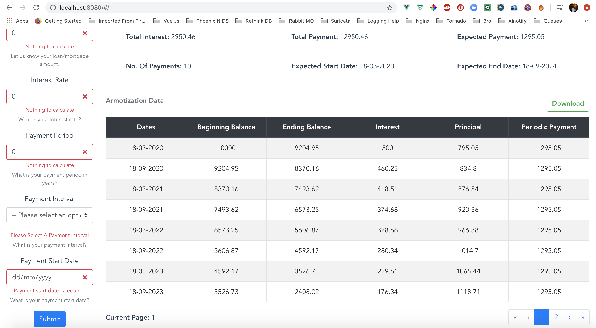
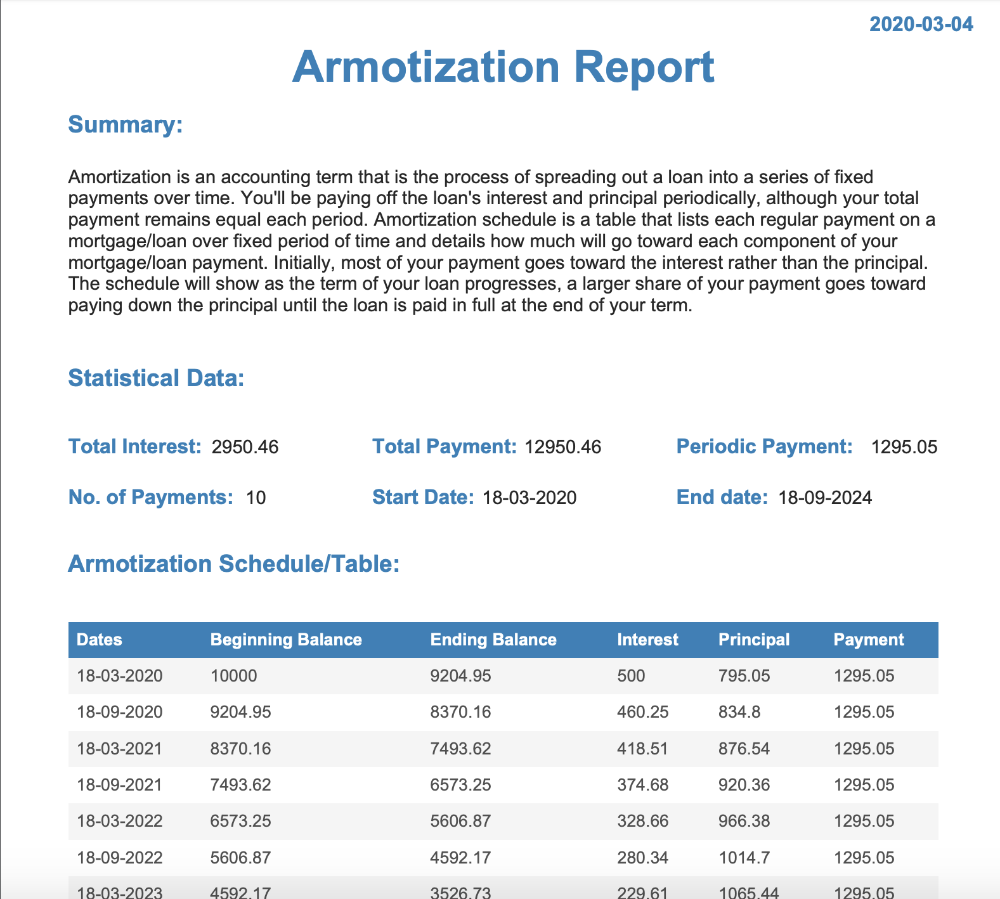

# Armotization Loan/Mortgage Calculator

*Amortization schedule details each periodic payment of a debt over time through regular payments on a a loan/mortgage, as generated by this armotization calculator.*

**Built with Tornado/Python, Vue, Vuex, Axios and BoostrapVue**

### To Start Using This Armotization Calculator

1. cd into armotization folder

2. python3 backend/run.py

3. npm run --prefix frontend serve

4. Open any Web Browser of your choice, Navigate to localhost:8080

### Screenshot Application Images

### To Dos
- [ ] Implementation using Vuetify
- [ ] Dockerize Application for easy install
- [ ] Restructure Application To use Frontend Component Instead of Bundling Vue Js Code in Main.js
